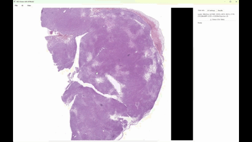
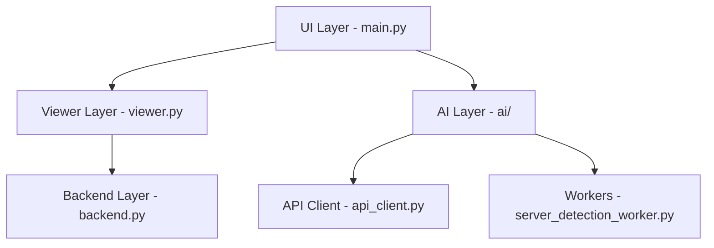

# TaegyuSlide - WSI Viewer with AI-Powered Object Detection



**TaegyuSlide**는 **Whole Slide Image (WSI) 뷰어**와 **AI 기반 Object Detection 감지 시스템**을 결합한 전문적인 병리학 이미지 분석 도구입니다.

## 🔬 주요 기능

### 📖 WSI 뷰어 기능
- **고성능 타일링 시스템**: 기가픽셀 단위의 대용량 슬라이드 이미지를 부드럽게 렌더링
- **멀티레벨 줌**: 5x ~ 40x 배율 지원 (피라미드 구조)
- **실시간 스트리밍**: 필요한 영역만 동적으로 로딩하여 메모리 효율성 극대화
- **하드웨어 가속**: OpenGL 뷰포트 지원으로 고성능 렌더링

### 🤖 AI 감지 기능
- **서버 기반 AI 추론**: HTTP API를 통한 객체 감지
- **배치 처리**: 대용량 슬라이드의 효율적인 병렬 처리
- **실시간 결과 표시**: 분석 진행 중 결과를 즉시 화면에 표시
- **정확한 좌표 매핑**: Level-0 좌표계 기반 정밀한 위치 추적

### 🎯 지원 파일 형식
- `.svs` (Aperio)
- `.ndpi` (Hamamatsu)
- `.scn` (Leica)
- `.mrxs` (3DHistech)
- `.tiff/.tif` (일반 TIFF)

## 🚀 빠른 시작

### 1. 환경 요구사항
- **Python**: 3.8 이상
- **운영체제**: Windows
- **메모리**: 8GB 이상 권장 (대용량 슬라이드용)
- **그래픽카드**: OpenGL 3.0 이상 지원 (선택사항)

### 2. 설치

```bash
# 저장소 클론
git clone https://github.com/kimtaegyu1223/TaegyuSlide.git
cd TaegyuSlide

# 의존성 설치
pip install -r requirements.txt

# OpenSlide 라이브러리 설치 (Windows)
pip install openslide-bin
```

### 3. AI 서버 설정

Detect 기능을 사용하려면 별도의 AI 서버에 모델이 필요합니다:

```python
# wsi_viewer/config.py에서 서버 주소 설정
server_base_url: str = "http://your-ai-server:8000"
```

### 4. 실행

```bash
python main.py
```

## 📁 프로젝트 구조

```
TaegyuSlide/
├── main.py                    # 메인 애플리케이션
├── requirements.txt           # 의존성 패키지 목록
├── wsi_viewer/               # 핵심 뷰어 모듈
│   ├── viewer.py             # WSI 뷰어 (타일링 엔진)
│   ├── backend.py            # OpenSlide 백엔드
│   ├── config.py             # 설정 관리
│   ├── tiling.py             # 비동기 타일 로딩
│   ├── overlay.py            # 결과 오버레이 시스템
│   └── ai/                   # AI 처리 모듈
│       ├── api_client.py     # AI 서버 통신
│       ├── server_detection_worker.py  # 서버 기반 감지 워커
│       ├── slide_processor.py          # 슬라이드 분석 및 패치 추출
│       └── tissue_detector.py          # 조직 영역 감지
└── lib/                      # 외부 라이브러리 (선택사항)
```

## 🏗️ 아키텍처

### 레이어드 아키텍처



### 핵심 컴포넌트

#### 1. **WSI 뷰어 엔진** (`viewer.py`)
- **타일링 시스템**: 1024x1024 타일 단위로 이미지 분할
- **LRU 캐시**: 최대 4096개 타일 캐싱 (약 4GB)
- **동적 로딩**: 화면에 보이는 영역만 로딩
- **레벨 전환**: 줌에 따라 적절한 해상도 레벨 자동 선택

#### 2. **백엔드 시스템** (`backend.py`)
- **OpenSlide 래퍼**: WSI 파일 형식 지원
- **좌표계 관리**: Level-0 기준 좌표 변환
- **에러 처리**: 강화된 예외 처리 및 로깅

#### 3. **AI 처리 시스템** (`ai/`)
- **서버 통신**: RESTful API 기반 HTTP 통신
- **배치 처리**: 효율적인 대용량 처리
- **실시간 피드백**: 진행 상황 및 결과 즉시 표시

## ⚙️ 주요 설정

### `wsi_viewer/config.py`

```python
@dataclass(frozen=True)
class ViewerConfig:
    tile_size: int = 1024           # 타일 크기
    cache_max_tiles: int = 4096     # 최대 캐시 타일 수
    zoom_factor_step: float = 1.35  # 줌 단계
    padding: int = 1000             # 슬라이드 패딩

@dataclass(frozen=True)
class AIConfig:
    server_base_url: str = "http://localhost:8000"
    patch_size: int = 512           # AI 분석용 패치 크기
    confidence_threshold: float = 0.5
    batch_size: int = 8
```

## 🔧 사용법

### 1. 슬라이드 열기
1. **File > Open...** 메뉴 선택
2. WSI 파일 (.svs, .ndpi 등) 선택
3. 슬라이드가 자동으로 로딩되어 화면에 표시

### 2. 화면 조작
- **마우스 드래그**: 화면 이동
- **마우스 휠**: 확대/축소
- **우클릭 드래그**: 정밀한 화면 이동

### 3. AI 감지 실행
1. **AI Settings** 탭에서 서버 연결 확인
2. 패치 크기, 배치 크기 등 설정
3. **🔬 Detect (Full Slide)** 버튼 클릭
4. 진행 상황을 **Results** 탭에서 모니터링

### 4. 결과 확인
- 감지된 객체 위치가 **빨간 사각형**으로 표시
- **신뢰도 점수**가 각 감지 결과에 표시
- **Fit Detections to View** 버튼으로 모든 결과 확인

## 🔍 디버깅 가이드

### 일반적인 문제들

#### 1. 슬라이드 로딩 실패
```
Error: OpenSlide 라이브러리를 찾을 수 없습니다
```
**해결**: `pip install openslide-python openslide-bin` 실행

#### 2. AI 서버 연결 실패
```
✗ Cannot connect to http://localhost:8000
```
**해결**:
- AI 서버 실행 상태 확인
- `config.py`에서 서버 주소 확인
- 방화벽 설정 확인

#### 3. 메모리 부족
```
MemoryError: 타일 크기를 줄여주세요
```
**해결**:
- `config.py`에서 `cache_max_tiles` 값 감소
- 더 낮은 해상도 레벨에서 작업
- 시스템 메모리 추가

### 로그 확인

프로그램 실행 시 상세한 로그가 콘솔에 출력됩니다:

```python
# 로그 레벨 변경 (main.py)
logging.basicConfig(
    level=logging.DEBUG,  # INFO → DEBUG로 변경
    format='%(asctime)s - %(name)s - %(levelname)s - %(message)s'
)
```

## 🛠️ 개발자 가이드

### 코드 구조 이해

#### 타일링 시스템 플로우
```python
# 1. 사용자 드래그/줌
viewer.scrollContentsBy() / wheelEvent()

# 2. 50ms 지연 후 타일 업데이트
update_visible_tiles()

# 3. 필요한 타일 계산
col0, row0, col1, row1 = calculate_visible_tiles()

# 4. 백그라운드 타일 로딩
TileScheduler.request() → TileTask.run()

# 5. 완료 시그널로 화면 업데이트
_on_tile_done() → scene.addItem()
```

#### AI 감지 플로우
```python
# 1. 사용자 감지 시작
detect_objects_full_slide()

# 2. 워커 생성 및 시작
ServerBasedDetectionWorker.start()

# 3. 슬라이드 분석
SlideProcessor.analyze_slide()

# 4. 패치 추출 및 API 호출
extract_tissue_patches() → ObjectDetectionAPIClient.detect_from_pil()

# 5. 결과 표시
add_object_detections() → OverlayItem.add_object_detections()
```

### 새로운 기능 추가

#### 1. 새로운 AI 모델 지원
`api_client.py`에서 감지 엔드포인트 추가:

```python
def detect_custom_model(self, image: Image.Image, model_name: str):
    request_data = {
        'image': self._image_to_base64(image),
        'model': model_name,
        'confidence_threshold': 0.5
    }
    # ... HTTP 요청 로직
```

#### 2. 새로운 파일 형식 지원
`backend.py`에서 파일 확장자 검사 로직 수정:

```python
SUPPORTED_FORMATS = ['.svs', '.ndpi', '.scn', '.mrxs', '.tiff', '.tif', '.new_format']
```

#### 3. 커스텀 오버레이 추가
`overlay.py`에서 새로운 그래픽 요소 추가:

```python
def draw_custom_annotation(self, painter: QPainter, annotation_data):
    # 커스텀 그래픽 그리기 로직
    pass
```

## 📊 성능 최적화

### 권장 설정

#### 고성능 시스템 (32GB RAM, 고급 GPU)
```python
ViewerConfig(
    tile_size=1024,
    cache_max_tiles=8192,  # 8GB 캐시
    use_opengl_viewport=True
)

AIConfig(
    batch_size=16,
    enable_batch_processing=True
)
```

#### 일반 시스템 (8GB RAM)
```python
ViewerConfig(
    tile_size=512,
    cache_max_tiles=2048,  # 2GB 캐시
    use_opengl_viewport=False
)

AIConfig(
    batch_size=4,
    enable_batch_processing=False
)
```

## 📄 라이선스

이 프로젝트는 MIT 라이선스 하에 배포됩니다. 자세한 내용은 `LICENSE` 파일을 참조하세요.

## 🙏 감사의 말

- **OpenSlide** 프로젝트 - WSI 파일 처리 라이브러리
- **PySide6** - Qt 기반 GUI 프레임워크
- **PIL/Pillow** - 이미지 처리 라이브러리

---

**TaegyuSlide** - *Professional WSI Analysis Made Simple* 🔬✨